# 🚀 Phễu Lead Magnet — Claude + N8N + Salekit.io

> **Gói "đóng sẵn" cho Khoá học Phễu** (Xây dựng hệ thống thu hút khách hàng bằng AI — kết hợp UNICA).
> Một cú bấm: **nhập 1 chủ đề → AI sinh Ebook + bộ ảnh Carousel + caption → đăng đa kênh → đẩy lead vào CRM + mở đường up-sell.**

Đây là quy trình + workflow để Coach (và học viên) **tạo ngay sản phẩm mồi** và **đăng đa kênh ngay và luôn**, nhằm tiếp cận tối đa traffic vào đầu phễu rồi up-sell sản phẩm/dịch vụ phía sau.

---

## ⚡ Nó làm gì (1 phút hiểu)

```
        ┌─────────────────────────────────────────────────────────────────┐
        │   BẠN NHẬP:  "Chủ đề / nỗi đau"  +  Avatar  (qua 1 form)          │
        └─────────────────────────────────────────────────────────────────┘
                                     │  1 cú bấm
                                     ▼
   ① TẠO MỒI (Claude)        ② RENDER ẤN PHẨM          ③ ĐĂNG & ĐẨY VÀO PHỄU
   ───────────────────       ──────────────────         ─────────────────────────
   claude-opus-4-8     →     Ebook → PDF          →      FB / IG / TikTok (Ayrshare)
   sinh JSON:                Carousel → ảnh 1080²         → hút traffic mới
   • ebook 5-7 chương                                     Salekit:
   • carousel 7 slide                                      • tạo lead + gắn tag
   • caption từng kênh                                     • gửi mồi Email/ZNS Zalo OA
   • câu up-sell                                           • mở đường VIP 1-1
```

Tất cả tự động trong **một workflow N8N** (15 node). Học viên chỉ cần sửa **1 node cấu hình** và (tuỳ chọn) tinh chỉnh prompt.

---

## 📦 Trong gói có gì

```
pheu-lead-magnet/
├── README.md                              ← bạn đang đọc (tổng quan + kiến trúc)
├── n8n/
│   ├── lead-magnet-multichannel.workflow.json   ← IMPORT THẲNG vào n8n
│   ├── SETUP.md                           ← cài đặt: credential, biến, test, go-live
│   └── _build_workflow.py                 ← builder (sửa prompt/biến → xuất lại JSON)
└── docs/
    ├── SOP-thiet-ke-ebook-lead-magnet.md  ← QUY TRÌNH dạy: tư duy phễu + công thức mồi
    └── prompts/
        └── claude-lead-magnet.prompt.md   ← toàn văn prompt (để tinh chỉnh)
```

| Bạn muốn… | Mở file |
|---|---|
| Cài đặt & chạy ngay | [`n8n/SETUP.md`](./n8n/SETUP.md) |
| Hiểu & dạy tư duy thiết kế mồi | [`docs/SOP-thiet-ke-ebook-lead-magnet.md`](./docs/SOP-thiet-ke-ebook-lead-magnet.md) |
| Tinh chỉnh prompt AI | [`docs/prompts/claude-lead-magnet.prompt.md`](./docs/prompts/claude-lead-magnet.prompt.md) |

---

## 🏗️ Kiến trúc workflow

```mermaid
flowchart LR
  F[1. Form: chủ đề & avatar] --> C[2. Cấu hình<br/>sửa biến tại đây]
  C --> P[3. Build prompt] --> CL[4. Claude<br/>claude-opus-4-8]
  CL --> J[5. Bóc tách JSON<br/>+ dựng HTML ebook]
  J --> PDF[6. Ebook → PDF]
  PDF --> G[6b. Gộp dữ liệu]
  G --> SP[7. Tách slide] --> SH[7b. HTML slide] --> IMG[8. Slide → ảnh]
  IMG --> AG[9. Gom ảnh]
  AG --> D[10. Build phân phối]
  D --> PUB[11. Đăng đa kênh<br/>FB/IG/TikTok]
  PUB --> SA[12. Salekit:<br/>tạo lead + tag]
  SA --> SN[13. Salekit:<br/>gửi mồi + up-sell]

  subgraph GĐ1[" GIAI ĐOẠN 1 · TẠO MỒI "]
    F & C & P & CL & J
  end
  subgraph GĐ2[" GIAI ĐOẠN 2 · RENDER "]
    PDF & G & SP & SH & IMG & AG
  end
  subgraph GĐ3[" GIAI ĐOẠN 3 · ĐĂNG & PHỄU "]
    D & PUB & SA & SN
  end
```



**Phân vai 3 công cụ:**
- **Claude** = bộ não sáng tạo (nghĩ mồi, viết đúng công thức phễu, xuất JSON sạch).
- **N8N** = dây chuyền tự động không-code (nối mọi khâu, 1 cú bấm).
- **Salekit.io** = CRM & chăm sóc kênh sở hữu (thu lead, tag, automation nurture, up-sell, ZNS Zalo OA).

---

## ▶️ Quick start (5 bước)

1. **Import** `n8n/lead-magnet-multichannel.workflow.json` vào n8n.
2. **Tạo 5 credential** (Claude, Render PDF, Render ảnh, Publisher, Salekit) — bảng chi tiết trong [`SETUP.md`](./n8n/SETUP.md#2-tạo-5-credential).
3. **Sửa node "2. Cau hinh"** (model, kênh đăng, link phễu, màu thương hiệu…).
4. **Test workflow** → mở form → nhập chủ đề → Submit → xem mồi ra + đăng + lead vào Salekit.
5. **Active** để go-live; gửi URL form cho team dùng hàng ngày.

> Chưa đủ tài khoản dịch vụ? Tất cả node ngoài Claude đã đặt **On Error = Continue** → test phần tạo mồi trước, bật dần các khâu sau.

---

## 🎓 Gắn với buổi học (UNICA)

| Buổi | Chủ đề | File tham chiếu |
|---|---|---|
| B1 | Tư duy phễu & 3 tiêu chí mồi | SOP §0–§2 |
| B2 | Sản xuất mồi bằng AI (ebook + carousel) | SOP §3–§4 + prompt |
| B3 | Render & thương hiệu hoá | SETUP §3, §5 |
| B4 | Đăng đa kênh | SOP §5 |
| B5 | CRM & Nurture (Salekit) | SOP §7 + SETUP §6 |
| B6 | Up-sell & Value Ladder | SOP §7–§9 |

---

## 🔧 Công nghệ & nguồn

- **Claude API** — model `claude-opus-4-8`, structured outputs (`output_config.format`). [platform.claude.com](https://platform.claude.com)
- **n8n** — automation no-code. [n8n.io](https://n8n.io)
- **Salekit.io** — CRM & Sales Funnel all-in-one (audience, ZNS Zalo OA, Email/SMS). [help.salekit.io](https://help.salekit.io)
- **Render:** [htmlcsstoimage.com](https://htmlcsstoimage.com) (ảnh) · [apitemplate.io](https://apitemplate.io) (PDF)
- **Đăng feed:** [ayrshare.com](https://www.ayrshare.com) (FB/IG/TikTok/Threads)

> Mọi nhà cung cấp đều **thay được** — chỉ cần đổi URL ở node *2. Cau hinh* và credential. Xem [`SETUP.md` §5](./n8n/SETUP.md#5-tuỳ-biến-nhà-cung-cấp-không-khoá-cứng).

---

*Phiên bản 1.0 — đóng gói cho hệ sinh thái **Thu Nhập AI** / thunhap.vn.*
